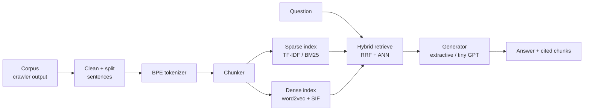

# scratch-rag

**A retrieval-augmented generation system with nothing borrowed.** No LangChain, no Hugging Face, no FAISS, no pretrained weights. Every layer — BPE tokenizer, chunker, TF-IDF/BM25, word2vec embeddings, ANN index, hybrid retriever, and a tiny GPT — is implemented from first principles.

The goal isn't answer quality. It's proof that every layer of a RAG stack can be built and measured by hand.

[](https://www.python.org/)
[](https://docs.astral.sh/uv/)
[](#license)
[](#progress)

---

## Why "from scratch"

Off-the-shelf RAG stacks hide the interesting parts behind a `.retrieve()` call. This project puts them back:

| Allowed | Forbidden |
|---|---|
| Python standard library | LangChain, LlamaIndex |
| NumPy | Hugging Face, scikit-learn, gensim |
| PyTorch tensors + autograd, `nn.Parameter`, `nn.Linear`, `nn.Embedding`, `torch.optim` | NLTK / spaCy tokenizers |
| `mps` device | FAISS |
| matplotlib (for plots) | `nn.Transformer*`, `nn.MultiheadAttention`, `F.scaled_dot_product_attention` |
| | Pretrained weights or external LLM APIs |

If a component needs math, it gets derived and coded here — not imported.

## Architecture



Everything left of the indexes runs once, offline. The query path runs from question to answer through hybrid retrieval and generation.

## Progress

Roughly 15–17 weeks at ~10 hours/week. The first demo-ready system lands at the end of Checkpoint 6.

| # | Checkpoint | Est. weeks | Deliverable | Status |
|---|---|---|---|---|
| 0 | Setup + corpus | 1 | Repo skeleton, 2–10 MB clean domain corpus | 🔄 In progress |
| 1 | Text processing + BPE | 1.5 | Trained tokenizer with encode/decode round-trip | ⬜ Not started |
| 2 | Chunking | 1 | Fixed + sentence-aware chunkers, chunk stats | ⬜ Not started |
| 3 | Sparse retrieval + eval | 2 | TF-IDF, BM25, labeled question set, Recall@k/MRR | ⬜ Not started |
| 4 | Dense embeddings | 2 | word2vec (SGNS) + SIF sentence vectors | ⬜ Not started |
| 5 | Hybrid + ANN index | 1.5 | RRF fusion, LSH or IVF index, speed vs recall plot | ⬜ Not started |
| 6 | Extractive answering | 1 | **End-to-end RAG v1** with CLI demo | ⬜ Not started |
| 7 | Tiny transformer | 3 | GPT-style model pretrained on the corpus | ⬜ Not started |
| 8 | RAG fine-tuning | 2 | Context-conditioned generator + evaluation | ⬜ Not started |
| 9 | Polish + showcase | 1 | README, ablation tables, demo video/UI | ⬜ Not started |

## Repo layout

```
rag/
├── text/        # cleaning, sentence splitting
├── tokenizer/   # BPE
├── chunking/    # fixed + sentence-aware chunkers
├── sparse/      # TF-IDF, BM25
├── dense/       # word2vec (SGNS), SIF
├── index/       # LSH / IVF, RRF fusion
├── generate/    # extractive answering, tiny GPT
└── eval/        # Recall@k, MRR, ablations
data/            # corpus.jsonl and derived artifacts
notes/           # cpN.md — design-choice writeups per checkpoint
tests/
```

## Getting started

```bash
uv sync
uv run scratch-rag
```

## Notes

Each checkpoint has a `notes/cpN.md` explaining the design choices behind it — why a given algorithm, what tradeoffs it makes, and what the "done when" test looked like. These double as the interview-answer version of this README.

## License

MIT
